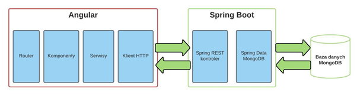

# Split2Go

## Informacje o aplikacji
Aplikacja stworzona do dzielenia wspólnych kosztów.
Interfejs użytkownika (front-end) został stworzony przy użyciu frameworku Angular. Strona serwerowa (back-end) została zaimplementowana w Javie przy użyciu frameworku Spring Boot.
## Wykorzystane technologie:
* Angular - Angular CLI: 11.2.5
* Spring Boot - Java 1.8 SDK 8

## Architektura aplikacji:

## Uruchomienie
Proces uruchamiania aplikacji należy zacząć od pobrania kodu z repozytorium `git clone https://github.com/Krzyszmaty73/PracaLicencjacka.git`
### Back-end
Aby uruchmić back-end należy użyć komendy `mvnw spring-boot:run` w folderze o nazwie SpringbootMongo
### Front-end
Aby uruchomić front-end z wykorzystaniem klienta HTTPS należy wejść do folderu o nazwie AngularSpringboot. Podczas uruchamiania należy podać poprawną ścieżkę, gdzie znajdują się pobrane wygenerowane certyfikaty `ng serve --ssl --ssl-key .\angularProject\certificates\localhost.key  --ssl-cert .\angularProject\certificates\localhost.crt`
### Strona
Następnie należy wpisać w przeglądarkę adres https://localhost:4200

## Status projektu
Projekt jest skończony. Planowana jest rozbudowa w późniejszym czasie.
